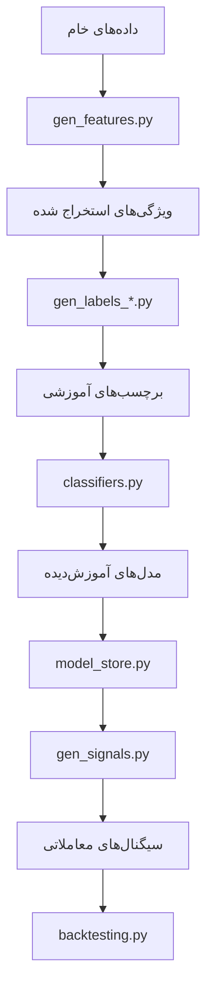

# 🧩 ماژول‌های مشترک (Common Modules)

## 📚 معرفی

ماژول‌های موجود در پوشه `common` شامل کلاس‌ها و توابع پایه‌ای هستند که در سراسر پروژه مورد استفاده قرار می‌گیرند. این ماژول‌ها به صورت ماژولار طراحی شده‌اند تا قابلیت استفاده مجدد و نگهداری آسان‌تر را فراهم کنند.

## 🏗️ ساختار پوشه

```
common/
├── __init__.py           # ماژول اصلی
├── backtesting.py        # ابزارهای بک‌تست و شبیه‌سازی معاملات
├── classifiers.py        # پیاده‌سازی الگوریتم‌های یادگیری ماشین
├── depth_processing.py   # پردازش عمق بازار (Order Book)
├── gen_features.py       # تولید ویژگی‌های پایه از داده‌های بازار
├── gen_features_rolling_agg.py # تولید ویژگی‌های تجمعی با پنجره‌های متحرک
├── gen_labels_highlow.py # تولید برچسب‌های High/Low برای مدل‌های طبقه‌بندی
├── gen_labels_topbot.py  # تولید برچسب‌های Top/Bottom برای تشخیص نقاط بازگشتی
├── gen_signals.py        # تولید سیگنال‌های معاملاتی از پیش‌بینی‌ها
├── generators.py         # کلاس‌های پایه برای تولید ویژگی‌ها و برچسب‌ها
├── model_store.py        # مدیریت مدل‌های یادگیری ماشین و پارامترها
├── my_feature_example.py # مثال ساخت ویژگی سفارشی
├── types.py              # تایپ‌ها، Enumها و ساختارهای داده
├── utils.py              # توابع کمکی عمومی
└── utils_mt5.py         # توابع کمکی مخصوص MetaTrader 5
```

## 🔍 توضیحات مفصل ماژول‌ها

### 1. `model_store.py`

#### وظیفه
مدیریت بارگذاری، ذخیره‌سازی و بازیابی مدل‌های یادگیری ماشین و پارامترهای آن‌ها.

#### کلاس‌های اصلی

```python
class ModelStore:
    """
    مدیریت مدل‌های یادگیری ماشین و پارامترهای آن‌ها
    """
    def __init__(self, config):
        """
        مقداردهی اولیه با تنظیمات پیکربندی
        """
        
    def load_models(self):
        """
        بارگذاری مدل‌ها از حافظه دائمی
        """
        
    def get_model(self, name):
        """
        دریافت مدل بر اساس نام
        """
        
    def put_model(self, name, model):
        """
        ذخیره مدل جدید
        """
```

#### مثال استفاده

```python
from common.model_store import ModelStore

# مقداردهی اولیه
model_store = ModelStore(config)

# بارگذاری مدل‌ها
model_store.load_models()

# دریافت یک مدل
rsi_model = model_store.get_model('rsi_classifier')

# ذخیره مدل جدید
model_store.put_model('new_model', trained_model)
```

### 2. `generators.py`

#### وظیفه
فراهم‌آوری کلاس‌های پایه برای تولید ویژگی‌ها و برچسب‌ها.

#### کلاس‌های اصلی

```python
class FeatureGenerator:
    """
    کلاس پایه برای تولید ویژگی‌های جدید از داده‌های خام
    """
    def generate(self, df, params):
        """
        تولید ویژگی‌های جدید
        """
        
class LabelGenerator:
    """
    کلاس پایه برای تولید برچسب‌های آموزشی
    """
    def generate(self, df, params):
        """
        تولید برچسب‌های آموزشی
        """
```

### 3. `gen_features.py` و `gen_features_rolling_agg.py`

#### وظیفه
تولید ویژگی‌های تکنیکال و آماری از داده‌های بازار.

#### توابع کلیدی

```python
def generate_features(df, config, model_store):
    """
    تولید ویژگی‌های تکنیکال از داده‌های OHLCV
    
    پارامترها:
        df: دیتافریم حاوی داده‌های بازار
        config: تنظیمات پیکربندی
        model_store: مخزن مدل‌ها
        
    بازگشت:
        دیتافریم حاوی ویژگی‌های تولید شده
    """
```

### 4. `gen_labels_highlow.py` و `gen_labels_topbot.py`

#### وظیفه
تولید برچسب‌های آموزشی برای مدل‌های یادگیری ماشین.

#### مثال

```python
def generate_highlow_labels(df, config):
    """
    تولید برچسب‌های High/Low برای تشخیص روند
    """
    
def generate_topbot_labels(df, config):
    """
    تولید برچسب‌های Top/Bottom برای تشخیص نقاط بازگشتی
    """
```

### 5. `backtesting.py`

#### وظیفه
شبیه‌سازی و ارزیابی استراتژی‌های معاملاتی بر روی داده‌های تاریخی.

#### مثال استفاده

```python
from common.backtesting import BacktestEngine

# تعریف استراتژی
class MyStrategy:
    def generate_signals(self, data):
        # منطق تولید سیگنال
        pass

# اجرای بک‌تست
engine = BacktestEngine()
results = engine.run(MyStrategy(), historical_data)
```

### 6. `classifiers.py`

#### وظیفه
پیاده‌سازی الگوریتم‌های یادگیری ماشین برای پیش‌بینی قیمت‌ها.

#### مثال

```python
class PricePredictor:
    def train(self, X, y):
        """
        آموزش مدل
        """
        
    def predict(self, X):
        """
        پیش‌بینی بر اساس مدل آموزش‌دیده
        """
```

### 7. `utils.py` و `utils_mt5.py`

#### توابع کلیدی

```python
# تبدیل داده‌های Kline به دیتافریم
def binance_klines_to_df(klines):
    """
    تبدیل داده‌های Kline به دیتافریم پانداس
    """

# تبدیل فرکانس Pandas به MT5
def mt5_freq_from_pandas(freq):
    """
    تبدیل فرکانس Pandas به فرمت MetaTrader 5
    """
```

## 🔄 جریان داده بین ماژول‌ها



## 🛠️ بهترین روش‌های استفاده

1. **مدیریت مدل‌ها**:
   - همیشه از `ModelStore` برای مدیریت مدل‌ها استفاده کنید
   - مدل‌های جدید را با نام‌های توصیفی ذخیره کنید
   - قبل از استفاده از مدل، از بارگذاری آن مطمئن شوید

2. **تولید ویژگی‌ها**:
   - از توابع موجود در `gen_features.py` استفاده کنید
   - برای ویژگی‌های سفارشی، از `my_feature_example.py` الگوبرداری کنید
   - از `generators.py` برای توسعه ژنراتورهای سفارشی استفاده کنید

3. **تولید برچسب‌ها**:
   - از `gen_labels_highlow.py` برای برچسب‌گذاری روندها
   - از `gen_labels_topbot.py` برای تشخیص نقاط بازگشتی

4. **اشکال‌زدایی**:
   - از توابع کمکی در `utils.py` برای عملیات رایج استفاده کنید
   - لاگ‌های مناسب در کد خود قرار دهید

## 📚 منابع بیشتر

- [مستندات Pandas](https://pandas.pydata.org/docs/)
- [مستندات TA-Lib](https://mrjbq7.github.io/ta-lib/)
- [مستندات Scikit-learn](https://scikit-learn.org/stable/documentation.html)
