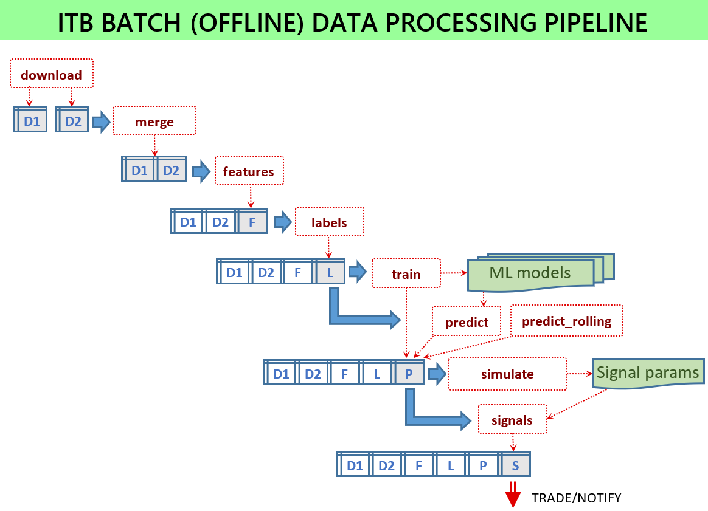

```
 ___       _       _ _ _                  _     _____              _ _               ____        _ 
|_ _|_ __ | |_ ___| | (_) __ _  ___ _ __ | |_  |_   _| __ __ _  __| (_)_ __   __ _  | __ )  ___ | |_
 | || '_ \| __/ _ \ | | |/ _` |/ _ \ '_ \| __|   | || '__/ _` |/ _` | | '_ \ / _` | |  _ \ / _ \| __|
 | || | | | ||  __/ | | | (_| |  __/ | | | |_    | || | | (_| | (_| | | | | | (_| | | |_) | (_) | |_ 
|___|_| |_|\__\___|_|_|_|\__, |\___|_| |_|\__|   |_||_|  \__,_|\__,_|_|_| |_|\__, | |____/ \___/ \__|
                         |___/                                               |___/                   
₿   Ξ   ₳   ₮   ✕   ◎   ●   Ð   Ł   Ƀ   Ⱥ   ∞   ξ   ◈   ꜩ   ɱ   ε   ɨ   Ɓ   Μ   Đ  ⓩ  Ο   Ӿ   Ɍ  ȿ
```

> [](https://t.me/intelligent_trading_signals) 📈 **<span style="font-size:1.5em;">[Intelligent Trading Signals](https://t.me/intelligent_trading_signals)</span>** 📉 **<https://t.me/intelligent_trading_signals>**

# Intelligent trading bot

The project is aimed at developing an intelligent trading bot for automated trading cryptocurrencies using state-of-the-art machine learning (ML) algorithms and feature engineering. The project provides the following major functionalities:
* Defining derived features using custom (Python) functions including technical indicators
* Analyzing historic data and training machine learning models in batch off-line mode
* Analyzing the predicted scores and choosing best signal parameters
* Signaling service which is regularly requests new data from the exchange and generates buy-sell signals by applying the previously trained models in on-line mode
* Trading service which does real trading by buying or selling the assets according to the generated signals

# Intelligent trading channel

The signaling service is running in cloud and sends its signals to this Telegram channel:

📈 **[Intelligent Trading Signals](https://t.me/intelligent_trading_signals)** 📉 **<https://t.me/intelligent_trading_signals>**

Everybody can subscribe to the channel to get the impression about the signals this bot generates.

Currently, the bot is configured using the following parameters:
* Exchange: Binance
* Cryptocurrency: ₿ Bitcoin
* Analysis frequency: 1 minute (currently the only option)
* Score between -1 and +1. <0 means likely to decrease, and >0 means likely to increase
* Filter: notifications are sent only if score is greater than ±0.20 (may change)
* One increase/decrease sign is added for each step of 0.05 (exceeding the filter threshold) 

There are silent periods when the score in lower than the threshold and no notifications are sent to the channel. If the score is greater than the threshold, then every minute a notification is sent which looks like 

> ₿ 24.518 📉📉📉 Score: -0.26

The first number is the latest close price. The score -0.26 means that it is very likely to see the price lower than the current close price. 

If the score exceeds some threshold specified in the model then buy or sell signal is generated which means that it is a good time to do a trade. Such notifications look as follows:

> 🟢 BUY: ₿ 24,033 Score: +0.34


# Training machine learning models (offline)



For the signaler service to work, a number of ML models must be trained and the model files available for the service. All scripts run in batch mode by loading some input data and storing some output files. The batch scripts are located in the `scripts` module.

If everything is configured then the following scripts have to be executed:
* `python -m scripts.download_binance -c config.json`
* `python -m scripts.merge -c config.json`
* `python -m scripts.features -c config.json`
* `python -m scripts.labels -c config.json`
* `python -m scripts.train -c config.json`
* `python -m scripts.signals -c config.json`
* `python -m scripts.train_signals -c config.json`

Without a configuration file the scripts will use the default parameters which is useful for testing purposes and not intended for showing good performance. Use sample configuration files which are provided for each release like `config-sample-v0.6.0.jsonc`.

## Downloading and merging source data

The main configuration parameter for the both scripts is a list of sources in ``data_sources``. One entry in this list specifies a data source as well as ``column_prefix`` used to distinguish columns with the same name from different sources. 

* Download the latest historic data: `python -m scripts.download_binance -c config.json`
  * It uses Binance API but you can use any other data source or download data manually using other scripts

* Merge several historic datasets into one dataset: `python -m scripts.merge -c config.json`
  * This script solves two problems: 1) there could be other sources like depth data or futures 2) a data source may have gaps so we need to produce a regular time raster in the output file

## Generate features

This script is intended for computing derived features:
* Script: `python -m scripts.features -c config.json`
* Currently it runs in non-incremental model by computing features for *all* available input records (and not only for the latest update), and hence it may take hours for complex configurations
* The script loads merged input data, applies feature generation procedures and stores all derived features in an output file
* Not all generated features will be used for training and prediction. For the train/predict phases, a separate list of features is specified 
* Feature functions get additional parameters like windows from the config section
* The same features must be used for on-line feature generation (in the service when they are generated for a micro-batch) and off-line feature generation.

The list of features to be generated is configured via ``feature_sets`` list in the configuration file. How features are generated is defined by the *feature generator* each having some parameters specified in its config section.

* ``talib`` feature generator relies on the TA-lib technical analysis library. Here an example of its configuration: ``"config":  {"columns": ["close"], "functions": ["SMA"], "windows": [5, 10, 15]}``
* ``itbstats`` feature generator implements functions which can be found in tsfresh like ``scipy_skew``, ``scipy_kurtosis``, ``lsbm`` (longest strike below mean), ``fmax`` (first location of maximum), ``mean``, ``std``, ``area``, ``slope``. Here are typical parameters: ``"config":  {"columns": ["close"], "functions": ["skew", "fmax"], "windows": [5, 10, 15]}``   
* ``itblib`` feature generator implemented in ITB but most of its features can be generated (much faster) via talib
* ``tsfresh`` generates functions from the tsfresh library

## Generate labels

This script is similar to feature generation because it adds new columns to the input file. However, these columns describe something that we want to predict and what is not known when executing in online mode. For example, it could be price increase in future:
* Script: `python -m scripts.labels -c config.json`
* The script loads features, computes label columns and stores the result in output file
* Not all generated labels have to be used. The labels to be used for training are specified in a separate list

The list of labels to be generated is configured via ``label_sets`` list in the configuration. One label set points to the function which generates additional columns. Their configuration is very similar to feature configurations.

* ``highlow`` label generator returns True if the price is higher than the specified threshold within some future horizon
* ``highlow2`` Computes future increases (decreases) with the conditions that there are no significant decreases (increases) before that. Here is its typical configuration: ``"config":  {"columns": ["close", "high", "low"], "function": "high", "thresholds": [1.0, 1.5, 2.0], "tolerance": 0.2, "horizon": 10080, "names": ["first_high_10", "first_high_15", "first_high_20"]}``
* ``topbot`` Deprecated
* ``topbot2`` Computes maximum and minimum values (labeled as True). Every labelled maximum (minimum) is guaranteed to be surrounded by minimums (maximums) lower (higher) than the specified level. The required minimum difference between adjacent minimums and maximums is specified via ``level`` parameters. The tolerance parameter allows for including also points close to the maximum/minimum. Here is a typical configuration: ``"config":  {"columns": "close", "function": "bot", "level": 0.02, "tolerances": [0.1, 0.2], "names": ["bot2_1", "bot2_2"]}``

## Train prediction models

This script uses the specified input features and labels to train several ML models:
* Script: `python -m scripts.train -c config.json`
* Hyper-parameter tuning is not part of this procedure - they are supposed to be known
* The algorithm descriptions and hyper-parameters are specified in the model store
* The results are stored as multiple model files in the model folder. File names are equal to the predicted column names and have this pattern: (label_name, algorithm_name)
* This script trains models for all specified labels and all specified algorithms
* The script also generates `prediction-metrics.txt` file with the prediction scores for all models

Configuration:
- Models and hyper-parameters are described in ``model_store.py``
- Features to be used for training are specified in ``train_features``
- List of labels is specified in ``labels``
- List of algorithms is specified in ``algorithms``

## Aggregation and post-processing

The goal of this step is to aggregate the prediction scores generated by different algorithms for different labels. The result is one score which is supposed to be consumed by the signal rules on the next step. The aggregation parameters are specified in the `score_aggregation` section. The `buy_labels` and `sell_labels` specify input prediction scores processed by the aggregation procedure. `window` is the number of previous steps used for rolling aggregation and `combine` is a way how two score types (buy and labels) are combined into one output score.

## Signal generation

The score generated by the aggregation procedure is some number and the goal of signal rules is to make the trading decisions: buy, sell or do nothing. The parameters of the signal rules are described in the `trade_model`.

## Train signal models

This script simulates trades using many buy-sell signal parameters and then chooses the best performing signal parameters:
* Script: `python -m scripts.train_signals -c config.json`

# Prediction online based on trained models (service)

This script starts a service which periodically executes one and the same task: load latest data, generate features, make predictions, generate signals, notify subscribers:
- Start script: `python -m service.server -c config.json`
- The service assumes that the models were trained using the features specified in the configuration
- The service uses credentials to access the exchange which are specified in the configuration

# Hyper-parameter tuning

There are two problems:
* How to choose best hyper-parameters for ML models. This problem is solved in the classical way, e.g., by grid search. For example, for Gradient Boosting, we train the model on the same data using different hyper-parameters and then select those showing the best score. This approach has one drawback - we optimize it for the best score which is not trading performance. This means that the trading performance is not guaranteed to be good (and in fact it will not be good). Therefore, we use this score as an intermediate feature with the goal to optimize trading performance on later stages.
* If we compute the final aggregated score (like +0.21), then the question is should we buy, sell or do nothing? In fact, it is the most difficult question. To help answer it, additional scripts were developed for backtesting and optimizing buy-sell signal generation:
  * Generate rolling predictions which simulates what we do by regularly re-training the models and using them for prediction: `python -m scripts.predict_rolling -c config.json`
  * Train signal models for choosing the best thresholds for sell-buy signals producing the best performance on historic data: `python -m scripts.train_signals -c config.json` 

# Configuration parameters

The configuration parameters are specified in two files:
* `service.App.py` in the `config` field of the `App` class
* `-c config.jsom` argument to the services and scripts. The values from this config file will overwrite those in the `App.config` when this file is loaded into a script or service

Here are some most important fields (in both `App.py` and `config.json`):
* `data_folder` - location of data files which are needed only for batch offline scripts
* `symbol` it is a trading pair like `BTCUSDT`
* Analyzer parameters. These mainly columns names.
  * `labels` List of column names which are treated as labels. If you define a new label used for training and then for prediction then you need to specify its name here
  * `algorithms` List of algorithm names used for training
  * `train_features` List of all column names used as input features for training and prediction.
* Signers:
  * ``buy_labels`` and ``sell_labels`` Lists of predicted columns used for signals
  * ``trade_model`` Parameters of the signaler (mainly some thresholds)
* `trader` is a section for trader parameters. Currently, not thoroughly tested.
* `collector` These parameter section is intended for data collection services. There are two types of data collection services: synchronous with regular requests to the data provider and asynchronous streaming service which subscribes to the data provider and gets notifications as soon as new data is available. They are working but not thoroughly tested and integrated into the main service. The current main usage pattern relies on manual batch data updates, feature generation and model training. One reason for having these data collection services is 1) to have faster updates 2) to have data not available in normal API like order book (there exist some features which use this data but they are not integrated into the main workflow).

See sample configuration files and comments in App.config for more details.

# Signaler service

Every minute, the signaler performs the following steps to make a prediction about whether the price is likely to increase or decrease:
* Retrieve the latest data from the server and update the current data window which includes some history (the history length is defined by a configuration parameter)
* Compute derived features based on the nearest history collected (which now includes the latest data). The features to be computed are described in the configuration file and are exactly the same as used in batch mode during model training
* Apply several (previously trained) ML models by forecasting some future values (not necessarily prices) which are also treated as (more complex) derived features. We apply several forecasting models (currently, Gradient Boosting, Neural network, and Linear regression) to several target variables (labels)
* Aggregate the results of forecasting produced by different ML models and compute the final signal score which reflects the strength of the upward or downward trend. Here we use many previously computed scores as inputs and derive one output score. Currently, it is implemented as an aggregation procedure but it could be based on a dedicated ML model trained on previously collected scores and the target variable. Positive score means growth and negative score means fall
* Use the final score for notifications

Notes:
* The final result of the signaler is the score (between -1 and +1). The score should be used for further decisions about buying or selling by taking into account other parameters and data sources
* For the signaler service to work, trained models have to be available and stored in the "MODELS" folder. The models are trained in batch mode and the process is described in the corresponding section.

Starting the service: `python3 -m service.server -c config.json`

# Trader

The trader is working but not thoroughly debugged, particularly, not tested for stability and reliability. Therefore, it should be considered a prototype with basic functionality. It is currently integrated with the Signaler but in a better design should be a separate service.

# Related projects

- https://github.com/CryptoSignal/Crypto-Signal Github.com/CryptoSignal - #1 Quant Trading & Technical Analysis Bot
- https://github.com/tensortrade-org/tensortrade An open source reinforcement learning framework for training, evaluating, and deploying robust trading agents
- https://github.com/Superalgos/Superalgos Free, open-source crypto trading bot, automated bitcoin / cryptocurrency trading software, algorithmic trading bots. Visually design your crypto trading bot, leveraging an integrated charting system, data-mining, backtesting, paper trading, and multi-server crypto bot deployments
- https://github.com/kieran-mackle/AutoTrader A Python-based development platform for automated trading systems - from backtesting to optimisation to livetrading
- https://github.com/areed1192/python-trading-robot A trading robot, that can submit basic orders in an automated fashion using the TD API
- https://github.com/jmrichardson/tuneta Intelligently optimizes technical indicators and optionally selects the least intercorrelated for use in machine learning models
- https://github.com/Erfaniaa/binance-futures-trading-bot Easy-to-use multi-strategic automatic trading for Binance Futures with Telegram integration
- https://github.com/smileinnovation/cryptocurrency-trading How to make profits in cryptocurrency trading with machine learning

Backtesting
- https://github.com/nautechsystems/nautilus_trader
- https://github.com/mementum/backtrader
- https://github.com/kernc/backtesting.py

External integrations
- https://github.com/ccxt/ccxt A JavaScript / Python / PHP cryptocurrency trading API with support for more than 100 bitcoin/altcoin exchanges
- https://github.com/aiogram/aiogram Is a pretty simple and fully asynchronous framework for Telegram Bot API
- https://github.com/sammchardy/python-binance
